## `// EL JUEGO`

Soy **Zarixxx**, entusiasta de la informática.
Me atrae lo que hay detrás de los sistemas: cómo funcionan, cómo se rompen y cómo se protegen.
Tres campos me tienen enganchado: **inteligencia artificial**, **ciberseguridad** y **big data**.

## `// LAS TRES PIEZAS`

<table>
  <tr>
    <td align="center" width="33%">
      <h3>🧩 01</h3>
      <b>IA</b> 
      Modelos, datos y cómo las máquinas aprenden
    </td>
    <td align="center" width="33%">
      <h3>🧩 02</h3>
      <b>CIBERSEGURIDAD</b> 
      Redes, amenazas y cómo defender un sistema
    </td>
    <td align="center" width="33%">
      <h3>🧩 03</h3>
      <b>BIG DATA</b> 
      Grandes volúmenes de datos y qué esconden
    </td>
  </tr>
</table>

## `// HERRAMIENTAS`

## `// PROYECTOS`

| | Proyecto | Qué es |
|:-:|---|---|
| 🧩 | [**zapd**](https://github.com/Zarixxx/zapd) | Herramienta de análisis de red y amenazas: escáner de puertos, VirusTotal, WHOIS y ping |
| 🧩 | [**WWW**](https://github.com/Zarixxx/WWW) | Mi web |

`// SIGUEN FALTANDO PIEZAS //`

